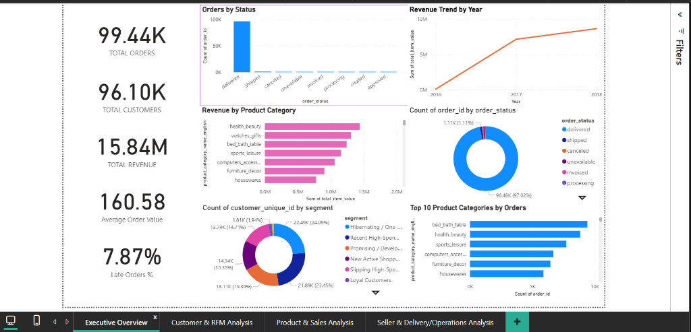
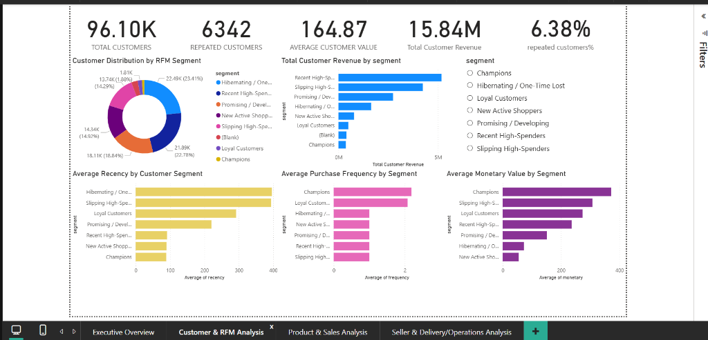
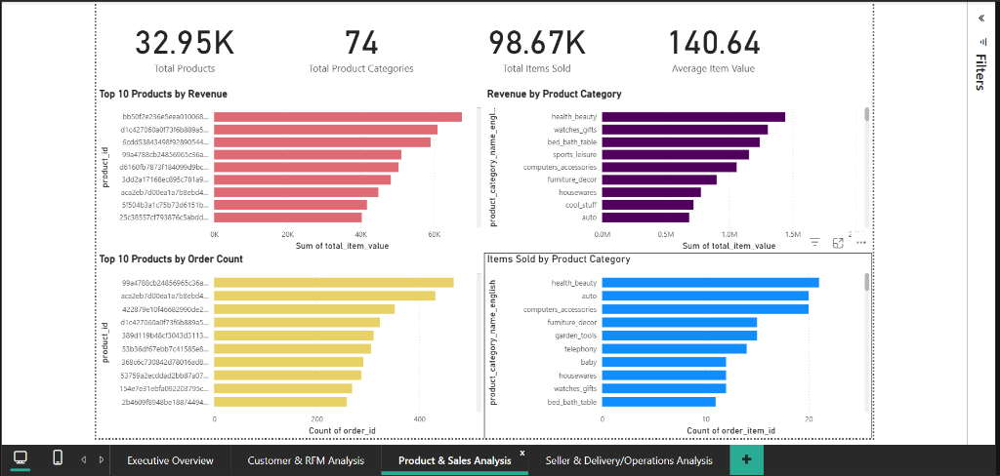
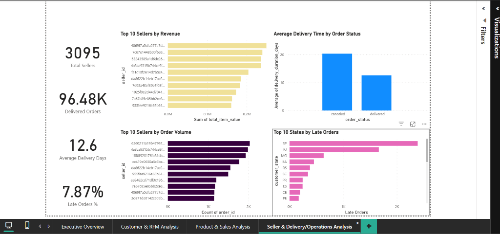

# Olist E-Commerce Sales & Customer Analytics

A comprehensive data analytics and business intelligence project evaluating commercial performance, customer behavior, product categories, and logistics operations across the Brazilian e-commerce marketplace **Olist**.

The project features an interactive 4-page Power BI dashboard driven by explicit DAX measures, dimensional modeling, and customer analytics (RFM segmentation and cohort retention).

---

## Project Overview

This project analyzes the Olist Brazilian E-Commerce dataset to provide stakeholders with visibility into:

* **Sales Performance:** Historical top-line revenue, order volumes, and average basket sizes.
* **Customer Behavior:** Customer valuation, repeat buyer share, and transaction frequencies.
* **RFM Customer Segmentation:** Behavioral clustering across Recency, Frequency, and Monetary value.
* **Product & Category Performance:** Anchor revenue categories and product-level volume distributions.
* **Seller Performance:** Merchant sales contributions and volume leaderboards.
* **Delivery Performance:** Door-to-door fulfillment transit times across order statuses.
* **Late-Order Patterns:** Regional concentration of delayed shipments across Brazilian states.

Power BI serves as the primary visual analytics platform, supported by DAX for business measures and a structured dimensional model.

---

## Business Objectives

1. **Understand overall e-commerce sales performance** and historical revenue trajectories.
2. **Identify important product categories and individual products** driving top-line GMV.
3. **Analyze customer behavior and value** to identify customer acquisition vs. retention dynamics.
4. **Segment customers using RFM analysis** to prioritize high-value consumer groups.
5. **Evaluate seller performance** to identify top marketplace merchant contributors.
6. **Analyze delivery performance** and fulfillment timelines across order fulfillment stages.
7. **Identify geographic concentration of late orders** across Brazilian federative states.
8. **Provide an executive-level view of business performance** to facilitate data-driven decision-making.

---

## Tools & Technologies

* **Power BI Desktop:** Star-schema data modeling, interactive visual reports, cross-filtering, and dashboard construction.
* **DAX (Data Analysis Expressions):** Formal measures for AOV, customer valuation, late delivery rates, and transit time metrics.
* **SQL / SQLite:** Database-driven exploratory analysis, data profiling, and pre-aggregation pipelines.
* **Data Modeling:** Star-style dimensional architecture connecting transactional facts to dimension entities.
* **Customer Analytics:** RFM (Recency, Frequency, Monetary) segmentation and Cohort Retention analysis.
* **CSV / Tabular Data:** Flat-file data interchange and source ingestion.

---

## Key Metrics

The metrics below represent the actual values currently displayed in the completed Power BI dashboard:

| Metric | Dashboard Value | Calculation Type |
| :--- | :---: | :--- |
| **Total Orders** | `99.44K` | Distinct Count of `fact_orders[order_id]` |
| **Total Customers** | `96.10K` | Distinct Count of `dim_customers[customer_unique_id]` |
| **Total Revenue** | `15.84M` | Sum of `fact_order_items[total item value]` |
| **Average Order Value** | `160.58` | Explicit DAX Measure (`DIVIDE`) |
| **Late Orders %** | `7.87%` | Explicit DAX Measure (`CALCULATE` + `DIVIDE`) |
| **Total Products** | `32.95K` | Distinct Count of `dim_products[product_id]` |
| **Product Categories** | `74` | Distinct Count of `dim_products[product_category_name_english]` |
| **Total Items Sold** | `98.67K` | Count of `fact_order_items[order_item_id]` |
| **Average Item Value** | `140.64` | Explicit DAX Measure (`AVERAGE`) |
| **Total Sellers** | `3,095` | Distinct Count of `dim_sellers[seller_id]` |
| **Delivered Orders** | `96.48K` | Distinct Count of `fact_orders[order_id]` (`order_status = "delivered"`) |
| **Average Delivery Days** | `12.6` | Explicit DAX Measure (`AVERAGE`) |
| **Repeat Customers** | `6,342` | Sum of `dim_customers[is_repeat_customer]` |
| **Average Customer Value** | `164.87` | Explicit DAX Measure (`DIVIDE`) |
| **Repeat Customer %** | `6.38%` | Average of `dim_customers[is_repeat_customer]` formatted as `%` |

---

## Dashboard Architecture

The Power BI report contains four completed analytical pages:

### 1. Executive Overview
Provides leadership with high-level marketplace monitoring.
* **KPI Cards:** Total Orders (`99.44K`), Total Customers (`96.10K`), Total Revenue (`15.84M`), Average Order Value (`160.58`), Late Orders % (`7.87%`).
* **Visuals:**
  * *Orders by Status* (Column Chart)
  * *Revenue Trend by Year* (Line Chart: 2016–2018)
  * *Revenue by Product Category* (Horizontal Bar Chart)
  * *Count of order_id by order_status* (Donut Chart: 97.02% delivered)
  * *Count of customer_unique_id by segment* (Donut Chart)
  * *Top 10 Product Categories by Orders* (Horizontal Bar Chart)

### 2. Customer & RFM Analysis
Explores customer lifecycle, customer valuation, and RFM behavioral segments.
* **KPI Cards:** Total Customers (`96.10K`), Repeated Customers (`6,342`), Average Customer Value (`164.87`), Total Customer Revenue (`15.84M`), Repeated Customers % (`6.38%`).
* **Visuals:**
  * *Customer Distribution by RFM Segment* (Donut Chart)
  * *Total Customer Revenue by segment* (Horizontal Bar Chart)
  * *Interactive Segment Slicer* (Single-select radio filter)
  * *Average Recency by Customer Segment* (Horizontal Bar Chart)
  * *Average Purchase Frequency by Segment* (Horizontal Bar Chart)
  * *Average Monetary Value by Segment* (Horizontal Bar Chart)

### 3. Product & Sales Analysis
Evaluates catalog variety, unit values, and category concentrations.
* **KPI Cards:** Total Products (`32.95K`), Total Product Categories (`74`), Total Items Sold (`98.67K`), Average Item Value (`140.64`).
* **Visuals:**
  * *Top 10 Products by Revenue* (Horizontal Bar Chart)
  * *Revenue by Product Category* (Horizontal Bar Chart)
  * *Top 10 Products by Order Count* (Horizontal Bar Chart)
  * *Items Sold by Product Category* (Horizontal Bar Chart)

### 4. Seller & Delivery Analysis
Evaluates marketplace logistics performance and merchant operations.
* **KPI Cards:** Total Sellers (`3,095`), Delivered Orders (`96.48K`), Average Delivery Days (`12.6`), Late Orders % (`7.87%`).
* **Visuals:**
  * *Top 10 Sellers by Revenue* (Horizontal Bar Chart)
  * *Average Delivery Time by Order Status* (Column Chart: Canceled vs. Delivered)
  * *Top 10 Sellers by Order Volume* (Horizontal Bar Chart)
  * *Top 10 States by Late Orders* (Horizontal Bar Chart: SP, RJ, MG, BA, RS, SC, PR, ES, CE, PE)

---

## Dashboard Screenshots

### 1. Executive Overview


---

### 2. Customer & RFM Analysis


---

### 3. Product & Sales Analysis


---

### 4. Seller & Delivery Analysis


---

## Data Model

The data model connects 10 analytical tables in a star-style dimensional framework:

* **Dimension Tables:**
  * `dim_customers`: Master customer lookup linking order IDs to human customer IDs (`customer_unique_id`) and repeat flags.
  * `dim_products`: Catalog of products with English category translations and dimensions.
  * `dim_sellers`: Directory of merchants with city and state information.
  * `dim_geolocation`: Geographic postal code lookup with deduplicated coordinates.
* **Fact Tables:**
  * `fact_orders`: Transaction header records with milestone timestamps and calculated delivery days.
  * `fact_order_items`: Sales line-item transactions with item prices, freight, and total item values.
  * `fact_order_payments`: Payment records covering payment methods, installments, and amounts.
  * `fact_order_reviews`: Customer survey ratings (1–5) deduplicated per order.
* **Analytical Tables:**
  * `rfm_customer_segments`: Customer-level table containing Recency, Frequency, Monetary values, and segments.
  * `cohort_retention_matrix`: Cohort retention data across monthly intervals; serves as home table for dashboard DAX measures.

For detailed relationship mappings and diagrams, refer to [`documentation/data-model.md`](documentation/data-model.md).

---

## Repository Structure

```
Olist_Ecommerce_Data_Analysis/
│
├── README.md                           # Main repository documentation
├── PACKAGE_CHECKLIST.md                # Submission verification checklist
├── .gitignore                          # Standard git ignore definitions
│
├── dashboard/
│   ├── Olist_Ecommerce_Dashboard.pbix  # Completed Power BI report file
│   └── README.md                       # Dashboard instructions and setup notes
│
├── screenshots/
│   ├── executive-overview.png          # Executive Overview page screenshot
│   ├── customer-rfm-analysis.png       # Customer & RFM Analysis screenshot
│   ├── product-sales-analysis.png      # Product & Sales Analysis screenshot
│   ├── seller-delivery-analysis.png    # Seller & Delivery Analysis screenshot
│   └── README.md                       # Screenshot documentation
│
├── dax/
│   ├── measures.md                     # Documented DAX formulas and aggregations
│   └── README.md                       # Overview of DAX calculation strategy
│
├── sql/
│   └── README.md                       # Documentation of SQL / SQLite processing role
│
├── data/
│   └── README.md                       # Schema catalog of the 10 analytical tables
│
└── documentation/
    ├── data-model.md                   # Detailed Star Schema documentation and diagram
    ├── methodology.md                  # Step-by-step project execution workflow
    └── business-insights.md            # Factual business findings from dashboard visuals
```

---

## How to Use

1. **Power BI Desktop:** Download and open [`dashboard/Olist_Ecommerce_Dashboard.pbix`](dashboard/Olist_Ecommerce_Dashboard.pbix) in Microsoft Power BI Desktop.
2. **Review Dashboard Pages:** Interact with slicers, tooltips, and cross-visual filtering across all four report tabs.
3. **Inspect Measures:** Review DAX formulas in [`dax/measures.md`](dax/measures.md).
4. **Data Connection Note:** The PBIX file contains pre-loaded data model tables. If you wish to refresh the data from external source files on your machine, reconfigure the file paths under Power Query (`Transform data` $\rightarrow$ `Data source settings`).

---

## Dataset

* **Name:** Olist Brazilian E-Commerce Public Dataset
* **Source:** Publicly released by Olist on [Kaggle](https://www.kaggle.com/datasets/olistbr/brazilian-ecommerce).
* **Storage Note:** To comply with repository hosting size recommendations, the raw CSV files are not duplicated in this repository.

---

## Limitations

* **Historical Timeframe:** The dataset covers transactions from September 2016 through October 2018; insights reflect market conditions during this period.
* **Low Repeat Purchase Baseline:** Because 93.6% of buyers made a single purchase during this window, retention metrics reflect marketplace customer acquisition rather than recurring subscription habits.
* **Logistics Estimates:** Delivery delay metrics rely on recorded carrier handover timestamps and static estimated delivery dates rather than dynamic real-time GPS telemetry.
