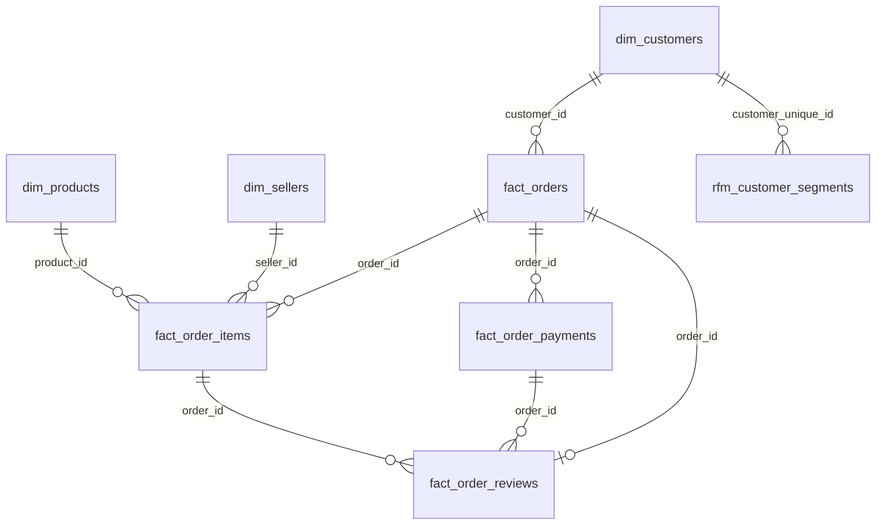

# Power BI Data Model Documentation

This document describes the analytical schema, table roles, and relational structure implemented in the **Olist E-Commerce Sales & Customer Analytics** Power BI dashboard.

---

## 1. Model Overview

The analytical data model uses a **Star-style dimensional architecture** designed to support cross-filtering across customer demographics, product categories, merchant profiles, operational fulfillment, and customer RFM segments.

---

## 2. Table Classification & Schema Grain

| Table | Classification | Grain / Primary Key | Foreign Keys / Linkage | Business Function |
| :--- | :--- | :--- | :--- | :--- |
| **`fact_orders`** | Fact (Header) | `order_id` | `customer_id` | Tracks transaction status, timestamps, transit duration, and delay flags. |
| **`fact_order_items`** | Fact (Line Item) | Composite: `order_id` + `order_item_id` | `order_id`, `product_id`, `seller_id` | Core sales transaction grain: price, freight, total item value per product sold. |
| **`fact_order_payments`** | Fact (Financial) | Composite: `order_id` + `payment_sequential` | `order_id` | Records payment types, installment plans, and transaction amounts. |
| **`fact_order_reviews`** | Fact (Feedback) | `order_id` (Deduplicated) | `order_id` | Records customer CSAT scores (1–5) and review submission dates. |
| **`dim_customers`** | Dimension | `customer_id` | `customer_zip_code_prefix` | Connects order tokens (`customer_id`) to human buyer IDs (`customer_unique_id`). |
| **`dim_products`** | Dimension | `product_id` | `product_category_name` | Master catalog of product physical dimensions and translated categories. |
| **`dim_sellers`** | Dimension | `seller_id` | `seller_zip_code_prefix` | Merchant directory with seller locations (city, state). |
| **`dim_geolocation`** | Dimension | `zip_code_prefix` | None | Brazilian geographic coordinate reference (median lat/lng). |
| **`rfm_customer_segments`**| Analytical Dim | `customer_unique_id` | None | Pre-calculated Recency, Frequency, Monetary values, and assigned segments. |
| **`cohort_retention_matrix`**| Analytical Matrix| `cohort_month` | None | Monthly cohort retention rates; also hosts dashboard measure definitions. |

---

## 3. Relational Wiring in the Model

The relationships present in the analytical model connect dimensional filters to transactional facts:

1. **`dim_products` $\rightarrow$ `fact_order_items`**:
   * *Key:* `product_id`
   * *Cardinality:* One-to-Many ($1:*$)
   * *Purpose:* Enables filtering item sales by product categories and dimensions.

2. **`dim_sellers` $\rightarrow$ `fact_order_items`**:
   * *Key:* `seller_id`
   * *Cardinality:* One-to-Many ($1:*$)
   * *Purpose:* Enables evaluating sales volume, revenue, and fulfillment by merchant.

3. **`fact_orders` $\rightarrow$ `fact_order_items`**:
   * *Key:* `order_id`
   * *Cardinality:* One-to-Many ($1:*$)
   * *Purpose:* Links order header metadata (dates, order status, transit duration) to individual line items.

4. **`dim_customers` $\rightarrow$ `fact_orders`**:
   * *Key:* `customer_id`
   * *Cardinality:* One-to-Many ($1:*$)
   * *Purpose:* Associates orders with customer geography and customer account information.

5. **`fact_orders` $\rightarrow$ `fact_order_payments`**:
   * *Key:* `order_id`
   * *Cardinality:* One-to-Many ($1:*$)
   * *Purpose:* Relates payment methods, installments, and payment values to order headers.

6. **`fact_orders` $\rightarrow$ `fact_order_reviews`**:
   * *Key:* `order_id`
   * *Cardinality:* One-to-One / One-to-Many ($1:1$)
   * *Purpose:* Connects customer review feedback and ratings to order fulfillment records.

7. **`dim_customers` $\rightarrow$ `rfm_customer_segments`**:
   * *Key:* `customer_unique_id`
   * *Cardinality:* Many-to-One / One-to-One ($*:1$)
   * *Purpose:* Connects individual customer profiles to their assigned RFM behavioral segment.

8. **`fact_order_items` $\leftrightarrow$ `fact_order_reviews`**:
   * *Key:* `order_id`
   * *Cardinality:* Many-to-Many ($*:*$) / Indirect via `fact_orders`
   * *Purpose:* Connects product-level transactions with review scores.

9. **`fact_order_payments` $\leftrightarrow$ `fact_order_reviews`**:
   * *Key:* `order_id`
   * *Cardinality:* Many-to-Many ($*:*$) / Indirect via `fact_orders`
   * *Purpose:* Relates payment methods to customer satisfaction surveys.
